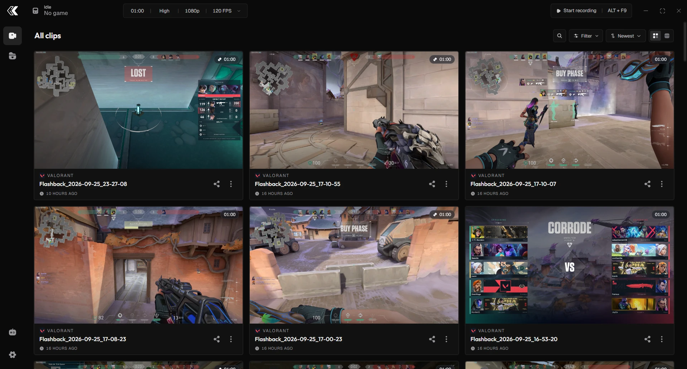
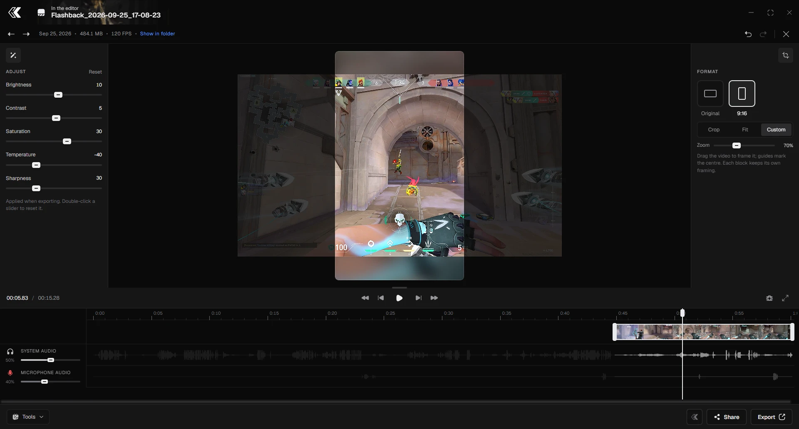
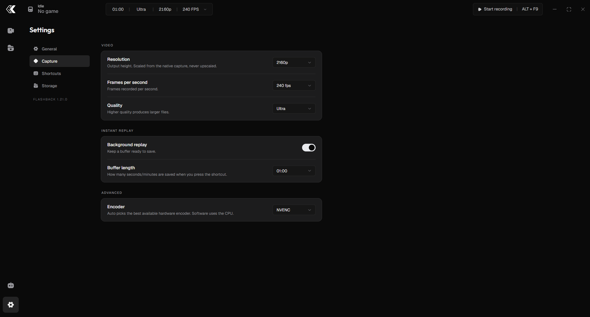

  

  <b>A lightweight game clip recorder and editor for Windows.</b> 
  Open it, play, and forget it's running. When something happens, it's already saved.

  
  
  

---

## Why Flashback

- **Light on your game.** Frames stay on the GPU from capture to encoder, with hardware encoding. The CPU barely notices.
- **Just clips.** No feed, no achievements, no accounts, no cloud. It records and edits clips, nothing else.
- **Instant.** Saving a replay, opening the library and trimming a clip take a moment, not a loading bar.
- **Good defaults.** 1080p60 out of the box. Everything is adjustable, and nothing gets in your way.

---

## Screenshots

  

  
  

---

## Features

### Capture

- **Instant Replay.** Keeps the last 30 seconds to 15 minutes in memory. Press a key and it's saved, with no re-encoding and no hitch in your game.
- **Manual recording.** Start and stop whenever you like. It uses the same encoder as the replay, and if the game or PC crashes, what you recorded is still playable.
- **Your quality.** 480p to 4K, 20 to 240 FPS and five quality levels, with an estimate of the clip size before you record.
- **Hardware encoding.** Automatically picks NVENC, Intel Quick Sync or AMD AMF, and falls back to software only when it has to.
- **Separate audio tracks.** Game sound and microphone are recorded on their own tracks, so you can mute either one later. Switching headphones mid-game doesn't stop the capture.
- **Knows what you're playing.** Clips are tagged with the game automatically.

### Editor

- **Trim and cut.** Trim the start and end, remove parts from the middle, and the rest is joined for you.
- **Fast exports.** When the cuts line up, the video is copied as is, in seconds and with no quality loss. Otherwise it's re-encoded on the GPU.
- **Vertical format.** Frame your clip for Shorts, TikTok or Reels, with a separate framing for each part.
- **Image adjustments.** Brightness, contrast, saturation, temperature and sharpness, with a before/after view.
- **The finishing touches.** Mute either audio track, grab a still frame, add an optional watermark, and export to MP4 or MOV.

### Library and sharing

- **Local library.** Your clips stay in a folder on your PC. Browse them by game, with each game's artwork.
- **Playlists.** Group clips without moving or copying files.
- **Share in seconds.** Drag a clip straight into any chat, or shrink it to 10, 50 or 100 MB first.
- **Plays other formats too.** Opens MP4, MOV, M4V, MKV and WebM.

### Everything else

- **Global shortcuts** that work even with a fullscreen game in front.
- **Your own save sound**, or none at all, and a choice of which on-screen notices to show.
- **Discord Rich Presence**, optional.
- **Automatic updates.**
- **English and Spanish.**

---

## Default shortcuts

| Action               | Shortcut    |
| -------------------- | ----------- |
| Save replay          | `Alt + F8`  |
| Start/stop recording | `Alt + F9`  |
| Open Flashback       | `Alt + F10` |

All of them can be changed in **Settings › Shortcuts**.

---

## Requirements

- **Windows 10 (version 1903 or later) or Windows 11.**
- A GPU with a hardware video encoder (NVIDIA, Intel or AMD) is recommended. Without one, Flashback falls back to software encoding.

---

## Privacy

Flashback runs entirely on your PC. There is no telemetry, no account and no sync.

The only network requests are for game detection and artwork (Discord's list of games, Steam, the Microsoft Store and SteamGridDB). They are optional, cached on disk, and never made while recording.

---

## Download

Get the latest installer from the [Releases](https://github.com/kuzteen/Flashback/releases/latest) page. After that, Flashback updates itself.

---

## License

[GPL-3.0](LICENSE) © 2026 kuzteen
